## **MEMBERS**

| ID       | Full Name            |
| -------- | -------------------- |
| SE193464 | Nguyễn Quốc Khánh    |
| SE193323 | Nguyễn Duy Thanh     |
| SE172634 | Võ Văn Phúc Ân       |
| SE193418 | Phạm Hoàng Minh Châu |

## **Project Name**: Watch Shop

## **Description**

The Watch Collecting based Website provides a perfect playground for those with same passion for timepieces. Whether a newcomer or an enthusiast, this community providing you a supportive, insightful space for bonding over beautiful watches. Not only an exquisite accessory on the wrist, the watches we have in-store are also versatile for those bonding over various of looks. Such a lavish hobby deserves a splendid, inviting website as ours.

## **Technology**

### **1. Front-end**

- HTML
- CSS
- JavaScript

### **2. Database**

- SQL Server

### **3. Back-end**

- Netbeans
- Java

## **Features**

### **1. User Management**

- **Login & Register**: Users can create an account and login.
- **Managing Profile**: Edit username, password and update profile picture.
- **Managing Shopping Cart**: Add, Update, View, Delete.

### **2. Products Management**

- **Post products**: Users can upload product(s).
- **Search products**: Users can view and search for desired product(s).
- **Products Detail**: Each watch includes Description, Number of Products Available, Number of Products Sold and Status (Available/Sold Out).

### **3. Orders Management**

- **Location and Contact**: Users choose a name, phone number and the address of the receiver.
- **Order summary**: Users receive a detailed summary of their order.

### **4. Database Management**

- **Admin**: To store admin information: `username`, `password`, `status`.
- **Users**: To store user information: `username`, `password`, `Full Name` ,`phone number`, `email`, `date of birth`, , `status`.
- **Products**: To store product information: `name`, `quantity`, `sold`, `price`, `category type`, `description`, `image links`.
- **Orders**: To store product information: `Total Price`, `Address` ,`Status`, `Created Date`, `Payment Method`, `Note`.

### **5. Filter**

- **Sort by Price**: Users can view products of the chosen price.
- **Sort by Alphabet**: Users can view producs sorted by A-Z or Z-A.

### **6. Overall Management** (Admin)

- **Users Management** : Admin can find , change the status user accounts.
- **Orders Management** : Admin can find , view
- **Products Management** : Admin can find , add , update, view , delete

# ScreenShot

## **1. GUI**

### **Home Page**

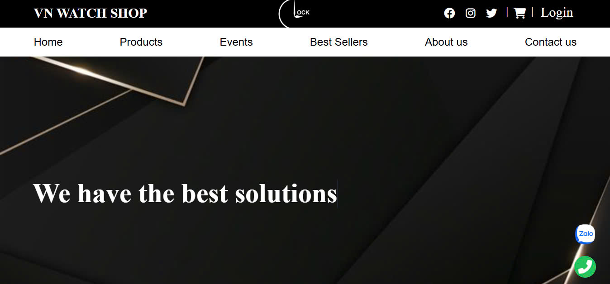

### **Login & Register Page**

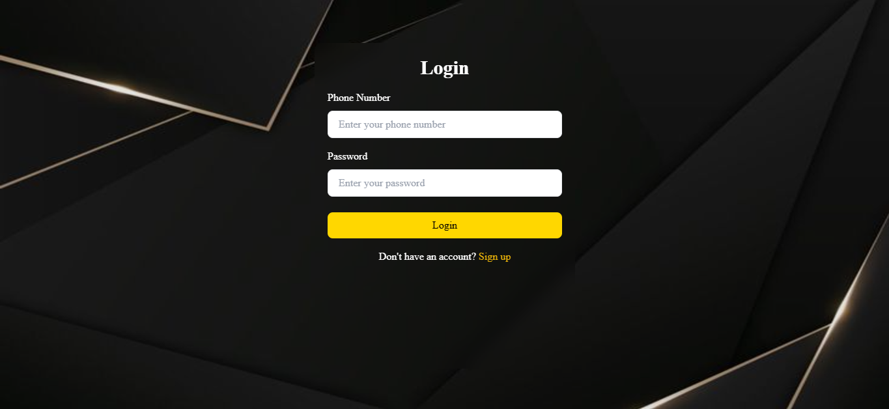
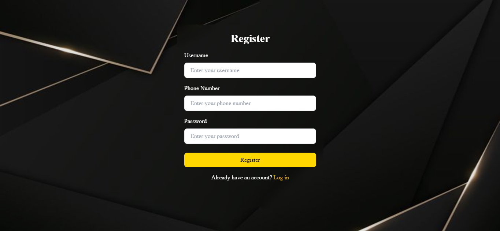

### **Product List**

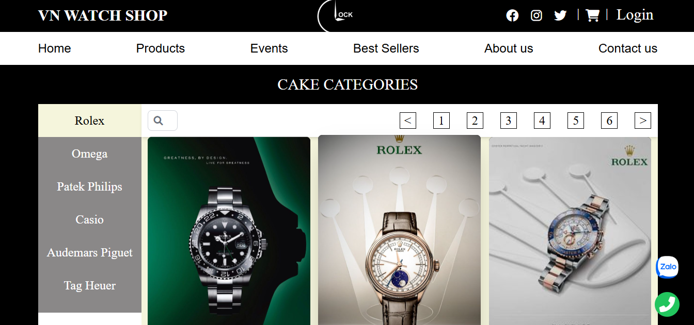
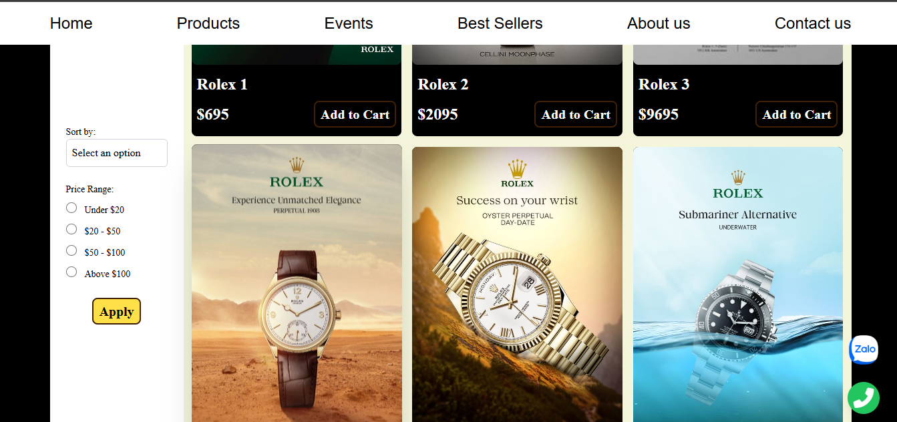

### **Product Description**

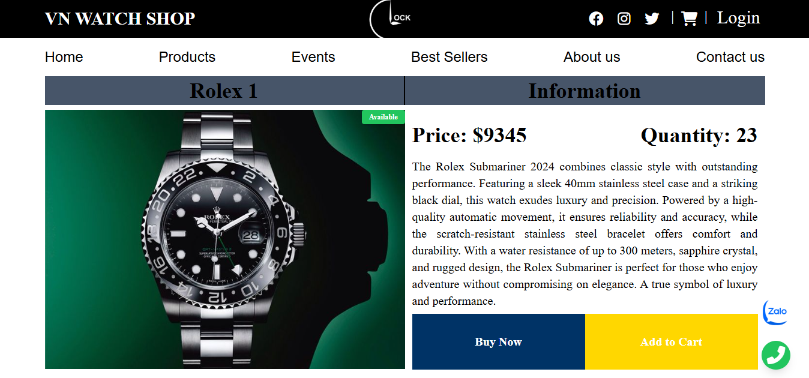
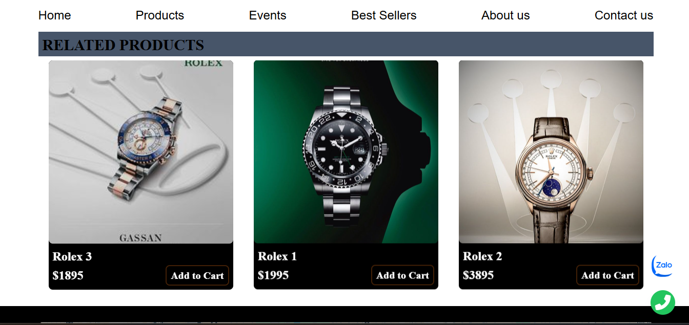

### **Shopping Cart**

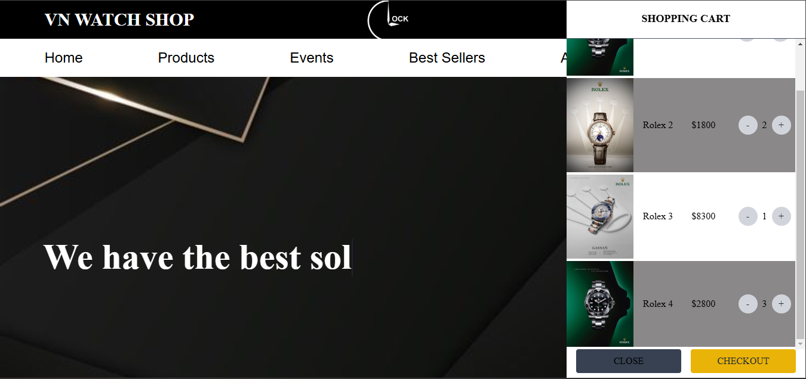
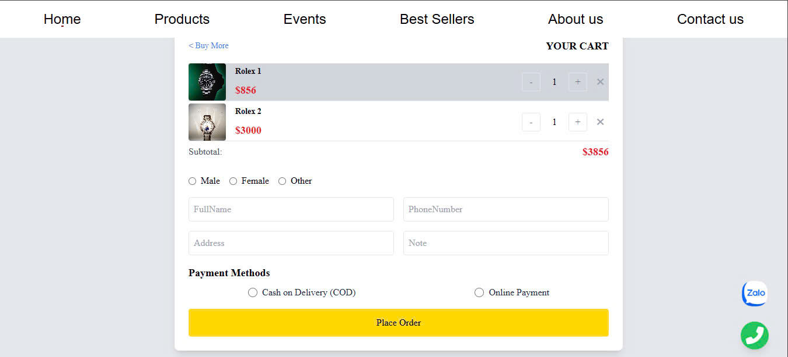
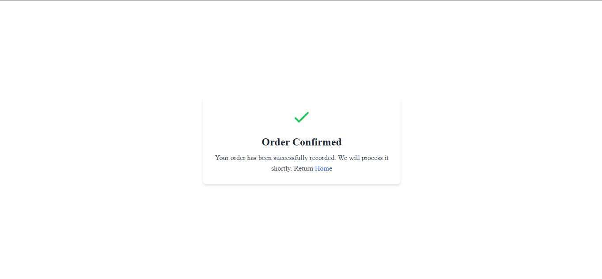

### **Admin Page**

**Admin Product Management Screen Example**

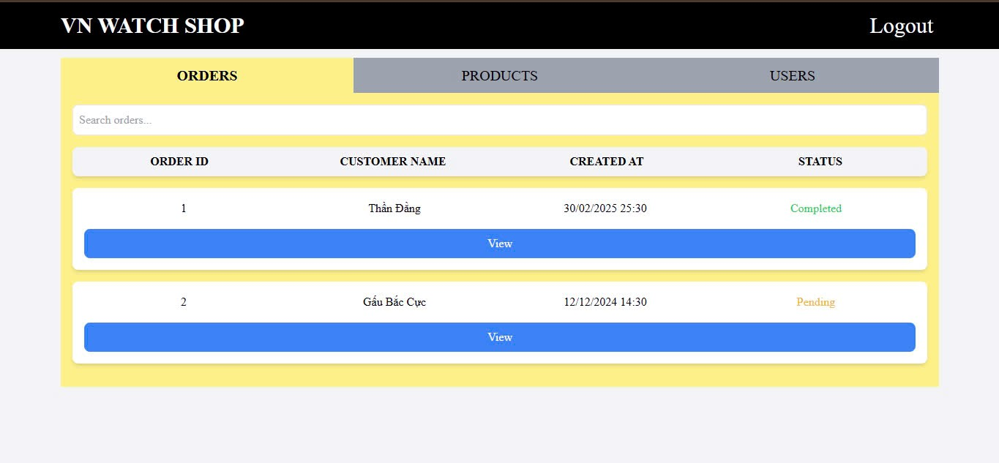
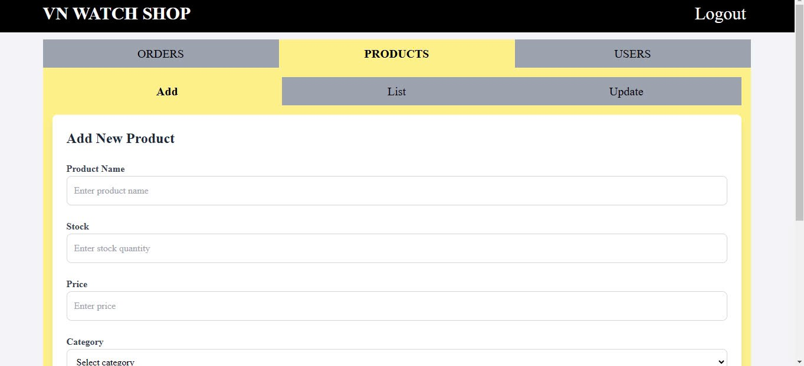
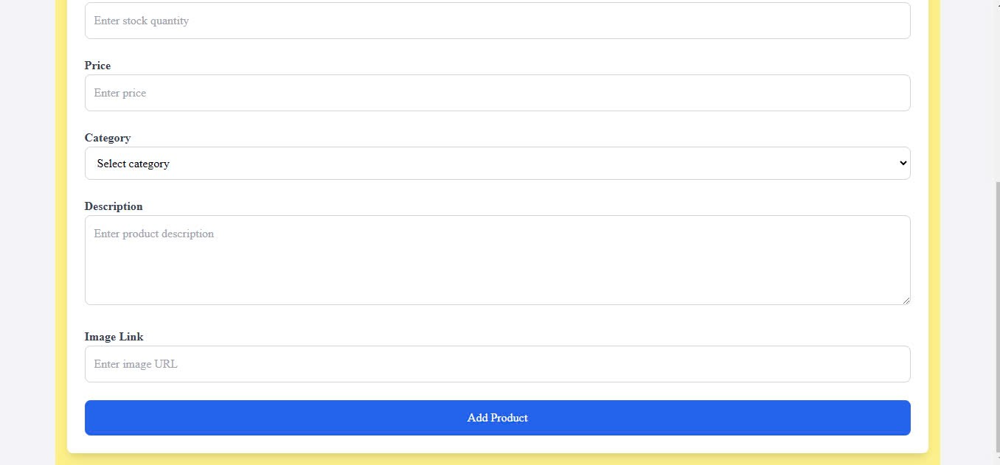
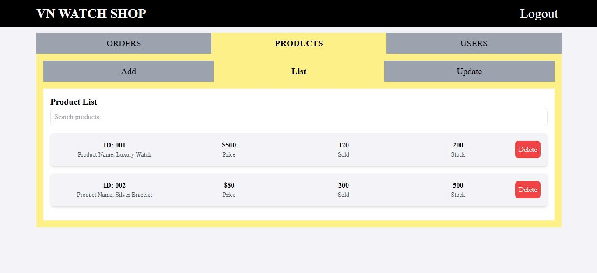
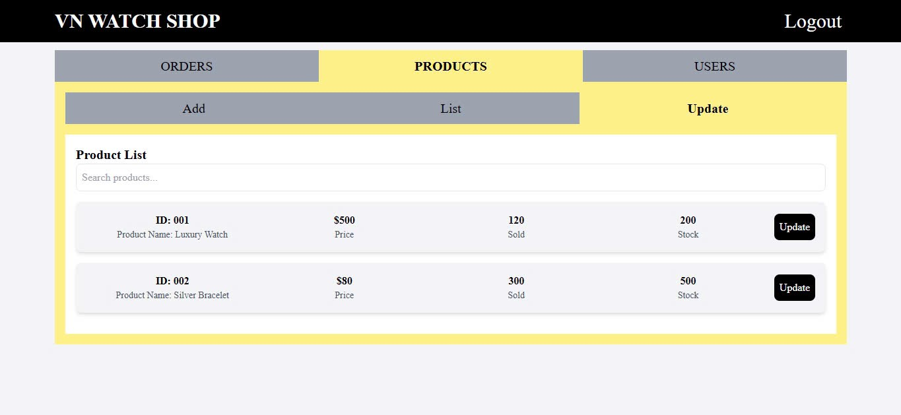
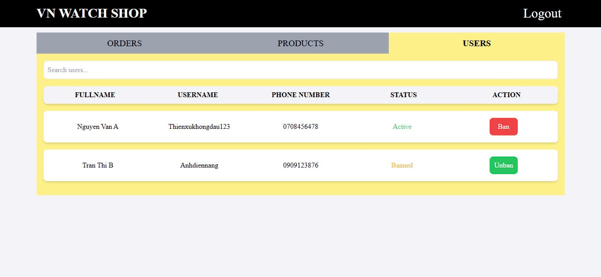
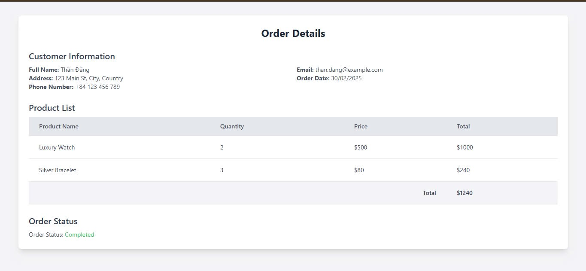

## **2. Database ERD**

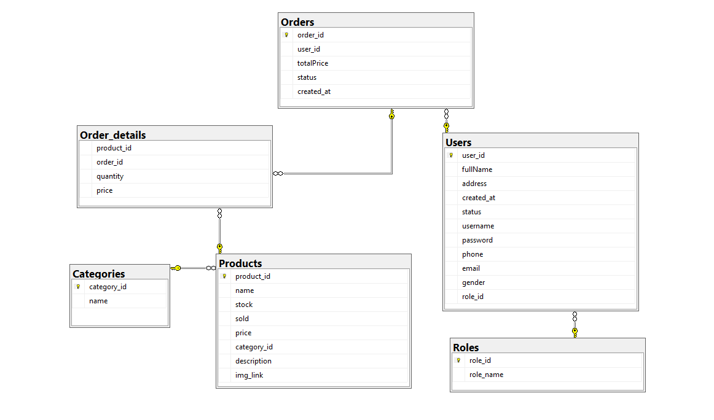

# **Project Structure**

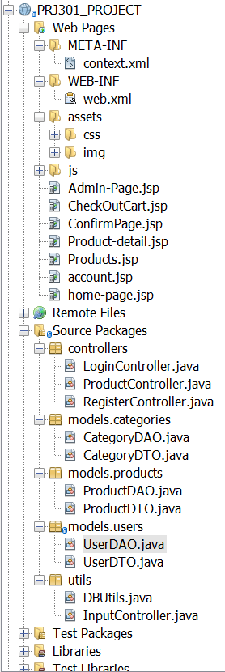

# Flow

# Some Thoughts

Being the first proper project we participate as a team, though many mishaps here and there, we see it now as opportunity, opportunity not only for us to know each and other team members but also a practice aims to enhance our skill in developing as an individual and perform as a group. Truely an unforgetable experience as a whole, not just the project alone but also the course as we get to know more about our desired field. Therefore this will be kept as a precious memory for us to carry throughout our career as software engineers. Thank you Mr. Dung, our lecturer for being such an incredible comfort and support, helping us getting through tough times. Sincerely, The 4-person team.

Some other thoughts from fellow team members:

- Khanh : To Mr. Dung, you are my captain, without you, I'm nothing but a sinking ship.
- Chau : From this project alone I have experienced the moment of having 7 bugs in 1 hour alone. What a memorable time to have.
- Thanh : I'm glad that from this project, I get a lot experiences, from things like headache, backache, soaring eyes, cold and fever here and there and an incredible routine of having 3 hours of sleep and 21 hours thinking about codes and deadlines.
- An : Through this assignment, I learned that just 1 dot, 1 "/" placed in the wrong place made me stay up until 2am, 1 a tag placed in the wrong place also caused a bug but the bug did not report an error. So I learned that reporting an error is fun but a bug that does not report an error is very tiring and a headache.
